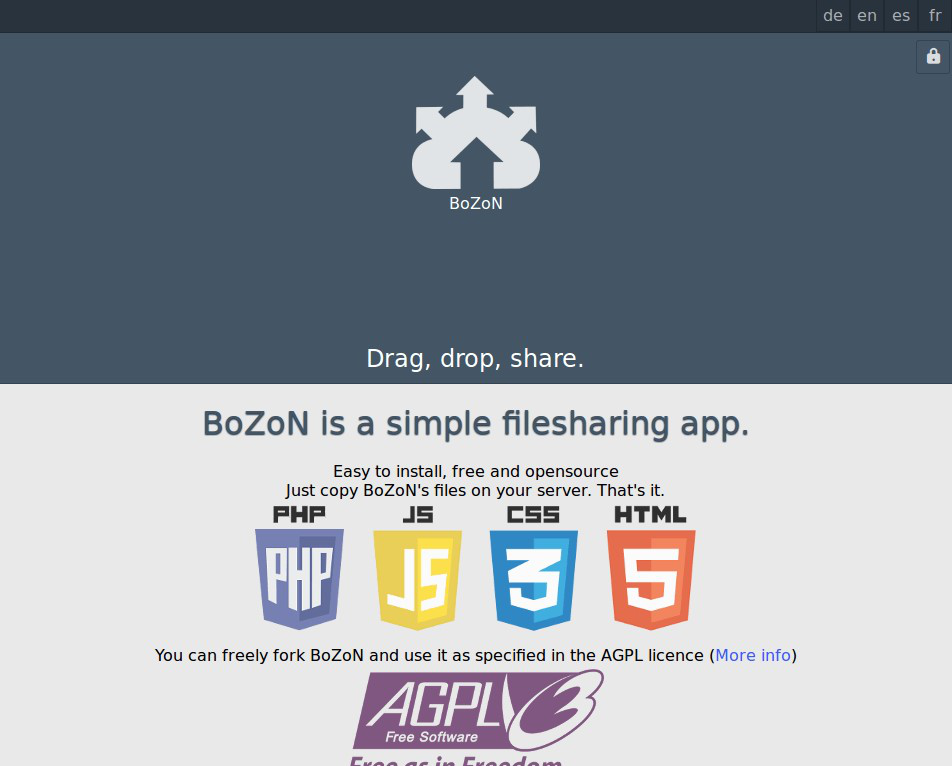

# BoZoN for YunoHost

[](https://dash.yunohost.org/appci/app/bozon)    
[](https://install-app.yunohost.org/?app=bozon)

> *This package allows you to install BoZoN quickly and simply on a YunoHost server.  
If you don't have YunoHost, please consult [the guide](https://yunohost.org/#/install) to learn how to install it.*

## Overview
BoZoN is a minimalist Drag & drop file sharing app.

**Shipped version:** 2.4.18

## Screenshots



## Configuration

How to configure this app: From an admin panel, a plain file with SSH, or any other way.

## Documentation

 * Official documentation: Link to the official documentation of this app
 * YunoHost documentation: If specific documentation is needed, feel free to contribute.

## YunoHost specific features

#### Multi-user support

* Are LDAP and HTTP auth supported?
* Can the app be used by multiple users?

#### Supported architectures

* x86-64 - [](https://ci-apps.yunohost.org/ci/apps/bozon/)
* ARMv8-A - [](https://ci-apps-arm.yunohost.org/ci/apps/bozon/)

## Limitations

* Any known limitations.

## Additional information

* Other info you would like to add about this app.

## Links

 * Report a bug: https://github.com/YunoHost-Apps/bozon_ynh/issues
 * Upstream app repository: https://github.com/broncowdd/BoZoN
 * YunoHost website: https://yunohost.org/

---

## Developer info

Please send your pull request to the [testing branch](https://github.com/YunoHost-Apps/bozon_ynh/tree/testing).

To try the testing branch, please proceed like that.
```
sudo yunohost app install https://github.com/YunoHost-Apps/bozon_ynh/tree/testing --debug
or
sudo yunohost app upgrade bozon -u https://github.com/YunoHost-Apps/bozon_ynh/tree/testing --debug
```
